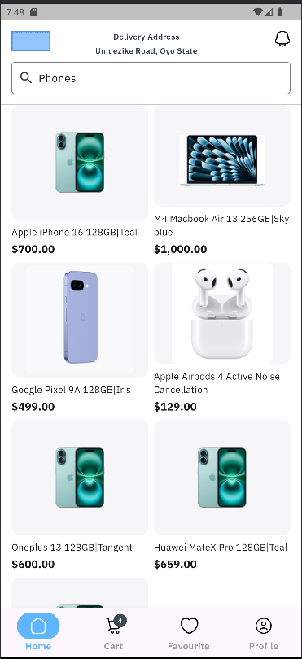
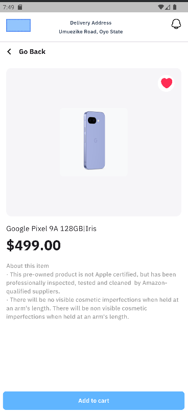
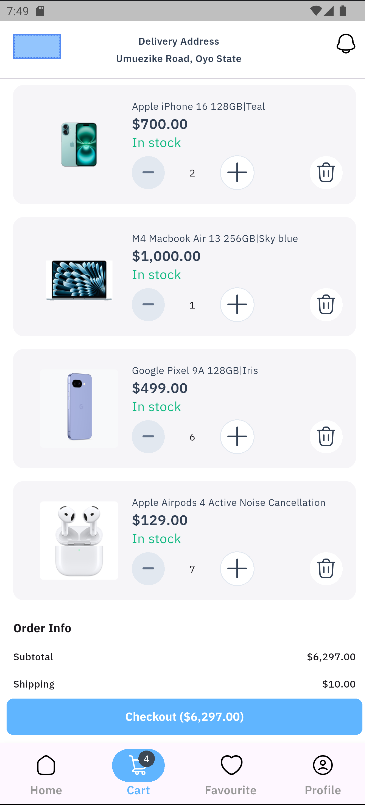

# Minimart 🛍️ - A Flutter E-Commerce App

A sleek, modern e-commerce application built with Flutter. This project serves as a template for a feature-rich online store, showcasing a clean architecture and a fluid user experience.

-----

## ✨ Features

* **Clean, Modern UI:** A visually appealing and easy-to-navigate interface.
* **Dark & Light Modes:** Seamless theme switching for user comfort.
* **State Management:** Efficient and predictable state handling with Provider.
* **Scalable Architecture:** Built on a robust and maintainable Clean Architecture.
* **Localization:** Ready for internationalization (`l10n`).

-----

## 📸 Screenshots

|                             Screen                             |
|:--------------------------------------------------------------:|
|     |
|  |
|     |
|       |

-----

## 🛠️ Tech Stack

* **Framework**: Flutter `3.22+`
* **Language**: Dart `3.4+`
* **Architecture**: Clean Architecture (Layered)
* **State Management**: `provider`
* **Navigation**: `auto_route`
* **Dependency Injection**: Custom `ServiceLocator` (using `build_runner`)
* **Localization**: `flutter_localizations` (l10n)
* **Styling**: Custom Theme with Dark/Light modes

-----

## 📂 Project Structure

The project follows the principles of **Clean Architecture** to ensure a separation of concerns, making it scalable and easy to maintain.

```plaintext
lib/
├── core/               # Core utilities, extensions, and constants
├── data/               # Data Layer: Repositories and Data Sources
│   ├── data_sources/   # Remote (API) and Local (DB) data fetching
│   └── repositories/   # Implementation of domain repositories
├── domain/             # Domain Layer: Core business logic (pure Dart)
│   ├── models/          # Core business models
│   └── usecases/       # Application-specific business rules
├── presentation/       # UI Layer: Widgets, Screens, and UI logic
│   ├── providers/      # State management providers
│   ├── router/         # Navigation and routing setup (AutoRoute)
│   ├── screens/        # Individual app screens/pages
│   ├── theme/          # Theming for light/dark modes
│   └── widgets/        # Reusable UI components
├── generated/          # Auto-generated files (l10n, routing, etc.)
├── l10n/               # Localization files
├── app.dart            # Main application widget
└── dependency_injection.dart # Dependency injection setup
```

-----

## 🚀 Getting Started

Follow these instructions to get the project up and running on your local machine.

### Prerequisites

* Flutter SDK (`3.22` or newer)
* Dart SDK (`3.4` or newer)
* An IDE like Android Studio or VS Code with the Flutter plugin.

### Installation & Setup

1.  **Clone the repository:**

    ```bash
    git clone https://github.com/josh4500/minimart.git
    cd minimart
    ```

2.  **Install dependencies:**

    ```bash
    flutter pub get
    ```

3.  **Generate required files:**
    This command generates localization strings, routes, and dependency injection files.

    ```bash
    flutter pub run build_runner build --delete-conflicting-outputs
    ```

4.  **Run the application:**

    ```bash
    flutter run
    ```

-----

## 🤯 Troubleshooting

If you encounter any issues during setup or runtime, try the following commands:

1.  **Clean the project:**

    ```bash
    flutter clean
    ```

2.  **Re-install dependencies:**

    ```bash
    flutter pub get
    ```

3.  **Re-run the code generator:**

    ```bash
    flutter pub run build_runner build --delete-conflicting-outputs
    ```

-----

## 🙌 Contributing

Pull requests are welcome\! If you'd like to contribute, please fork the repository and create a pull request. For major changes, please open an issue first to discuss what you would like to change.

Please make sure to:

* Follow the existing code architecture and style.
* Add tests for any new features.
* Update localization files if you add or change text.
* Keep the UI consistent with the existing theme.